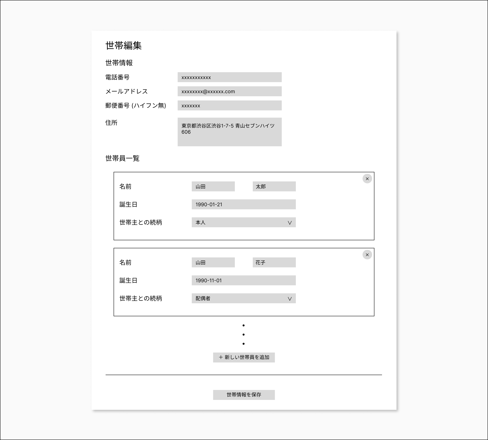

# backend-coding-test-v1

## Setup

```sh
cd backend-coding-test-v1
docker-compose build --no-cache
docker-compose up -d

./exec.sh php
composer install # in container
```

Access to [http://localhost:8092/api](http://localhost:8092/api)

## シェルの起動

```
./exec.sh [php|nginx|mysql]
```

## ログの確認

```
./logs.sh [php|nginx|mysql]
```

## 課題概要

- とある CRM における世帯および世帯員の管理ページについて、要件定義 (後述) を満たすように必要なエンドポイントを洗い出し、実装してください。
- **課題では UI (View) を実装する必要はありません。**

### 使用技術

- 基本構成
  - 言語
    - PHP 8.2
  - フレームワーク
    - Laravel 10
  - データベース
    - MySQL 8.0
  - サーバー
    - Nginx
- バージョンのアップデートは適宜行っていただいて構いません。
- 適宜外部ライブラリを追加していただいて構いません。
  - 追加したライブラリは、課題提出時にその導入理由を説明したドキュメントを添付してください。

### 提出方法

以下のファイルを zip に圧縮し、担当者にメール等で送付してください。

- 実装したソースコード
- (外部ライブラリを追加した場合) 追加したライブラリとその導入理由を説明したドキュメント

締め切り: **課題開始から 14 日後の 23:59 まで**

※ 実装の途中であったとしても、完成したところまでで提出してください。  
※ **締め切りまでに課題の提出されなかった場合は、不採用となりますのご注意ください。**

## 要件定義

### 世帯編集ページ



#### 概要

- 選択した世帯や世帯員情報を編集するページ
- URL: /households/:householdId
  - :householdId は編集対象の世帯id

#### 機能

##### 編集対象の世帯情報の表示

- ページアクセス時に、編集対象の世帯およびそれに紐づく世帯員情報が各フォームの初期値として入力された状態で表示される

##### 世帯情報の入力

- 以下の項目を入力できるフォームが表示されている (すべて必須項目)
  - 電話番号 (ハイフン無)
    - 形式: テキストボックス
    - placeholder: 10 桁もしくは 11 桁の半角数字を入力
    - 入力条件: 10 桁もしくは 11 桁の半角数字
    - 入力条件を満たしていない場合のエラーメッセージ: 10 桁もしくは 11 桁の半角数字を入力してください
  - メールアドレス
    - 形式: テキストボックス
    - placeholder: メールアドレスを入力
    - 入力条件: `^[a-zA-Z0-9_.+-]+@[a-zA-Z0-9-]+\.[a-zA-Z0-9-.]+$` に従っている
    - 入力条件を満たしていない場合のエラーメッセージ: メールアドレスの形式で入力してください
  - 郵便番号 (ハイフン無)
    - 形式: テキストボックス
    - placeholder: 7 桁の半角数字を入力
    - 入力条件: 7 桁の半角数字
    - 入力条件を満たしていない場合のエラーメッセージ: 7 桁の半角数字を入力してください
  - 住所
    - 形式: テキストエリア
    - 入力条件: 1 文字以上
    - 入力条件を満たしていない場合のエラーメッセージ: 住所を入力してください
- 各入力項目のフォーカスが外れたときに入力条件を満たしていない項目がある場合、その項目の下にエラーメッセージを表示し、「世帯情報を保存」ボタンを disabled にする

##### 世帯員情報の追加・入力・削除

- 以下の項目を入力できるフォームが表示されている (すべて必須項目)
  - 姓
    - 形式: テキストボックス
    - placeholder: 姓
    - 新規追加時の初期値: (空)
    - 入力条件: 1 文字以上
    - 入力条件を満たしていない場合のエラーメッセージ: 姓を入力してください
  - 名
    - 形式: テキストボックス
    - placeholder: 名
    - 新規追加時の初期値: (空)
    - 入力条件: 1 文字以上
    - 入力条件を満たしていない場合のエラーメッセージ: 名を入力してください
  - 誕生日
    - 形式: テキストボックス
    - placeholder: 例）1990-01-21
    - 新規追加時の初期値: (空)
    - 入力条件: `^\d{4}-\d{2}-\d{2}$` に従う、実在する過去の日付
    - 入力条件を満たしていない場合のエラーメッセージ: 誕生日を正しく入力してください
  - 世帯主との続柄
    - 形式: セレクター
    - 新規追加時の初期値: (未選択)
    - 入力条件:
      - 以下のいずれかの値が選択されている
        - 本人
        - 配偶者
        - 子
        - 父
        - 母
        - 兄
        - 弟
        - 姉
        - 妹
        - 義父
        - 義母
        - 義兄
        - 義弟
        - 義姉
        - 義妹
        - 孫
        - ひ孫
        - おじ
        - おば
        - いとこ
        - 祖父
        - 祖母
        - 曽祖父
        - 曽祖母
        - 姪
        - 甥
        - その他
      - 世帯員の中に世帯主との続柄が「本人」となる人が必ず 1 人存在する
    - 入力条件を満たしていない場合のエラーメッセージ:
      - 未選択の場合: この項目は必須です
      - 世帯員の中に「本人」が存在しない、または複数人存在する場合: 世帯主との続柄が「本人」となる世帯員が 1 人存在する必要があります
- 「新しい世帯員を追加」ボタンを押すことで、世帯員情報の入力フォームが追加される
- 「削除」アイコンボタンを押すと、対象の世帯員情報が画面から削除される
  - 実際に DB から世帯員を削除する処理は、世帯情報の保存時に行う
- 各入力項目のフォーカスが外れたときに入力条件を満たしていない項目がある場合、その項目の下にエラーメッセージを表示し、「世帯情報を保存」ボタンを disabled にする

##### 世帯員情報の保存

- 「世帯情報を保存」ボタンを押すことで、householdId で指定された世帯およびそれに紐づく世帯員を入力された情報で保存する
